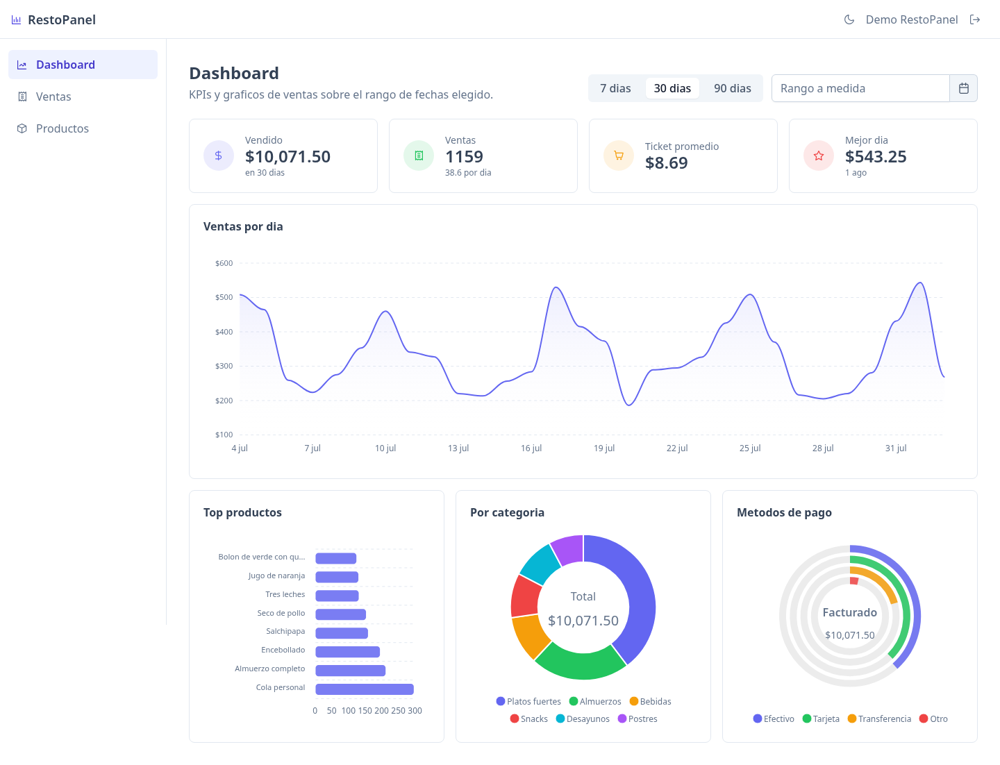
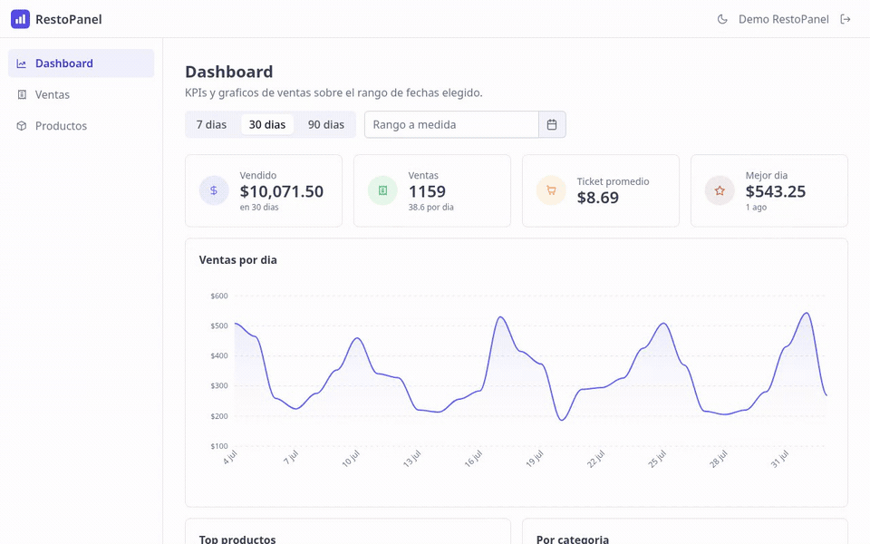
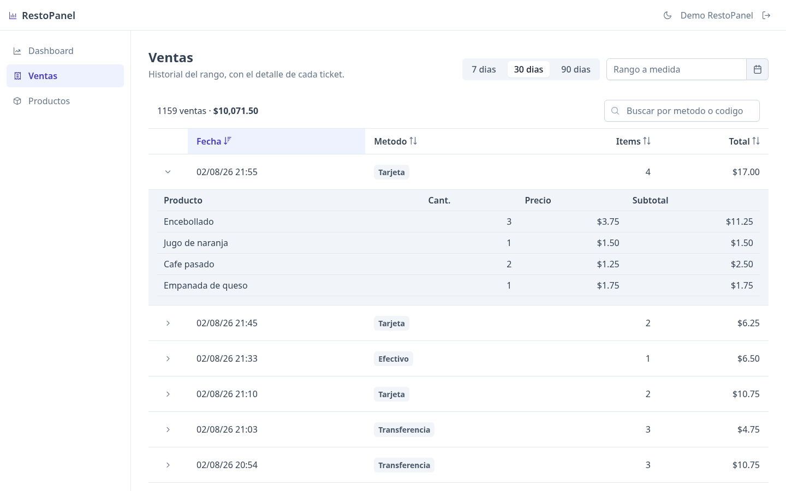
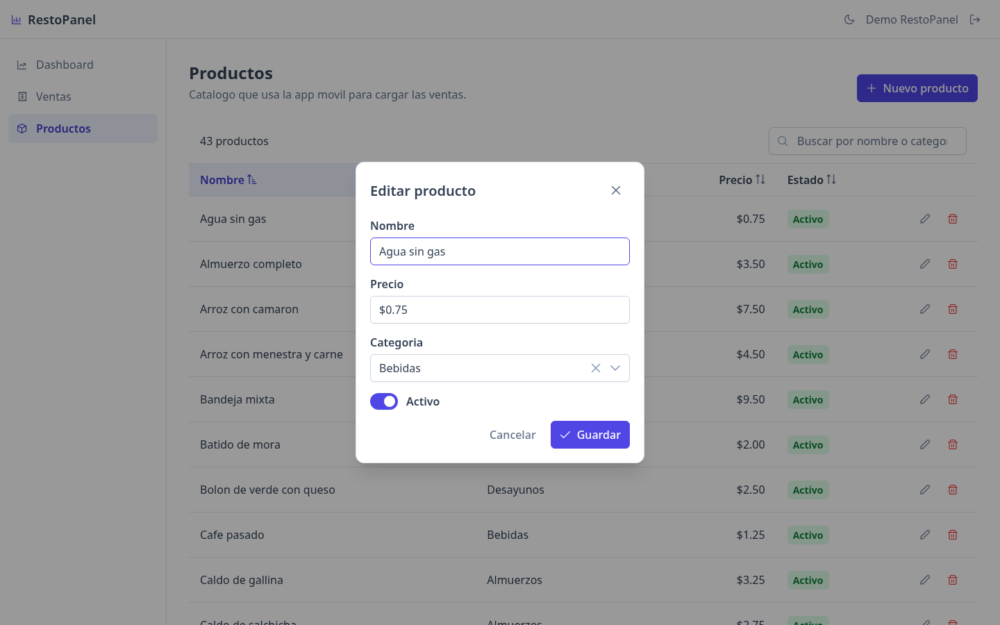
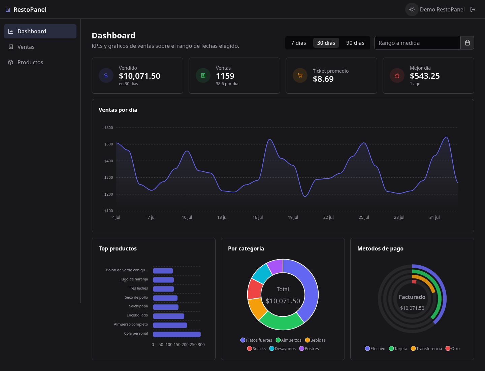
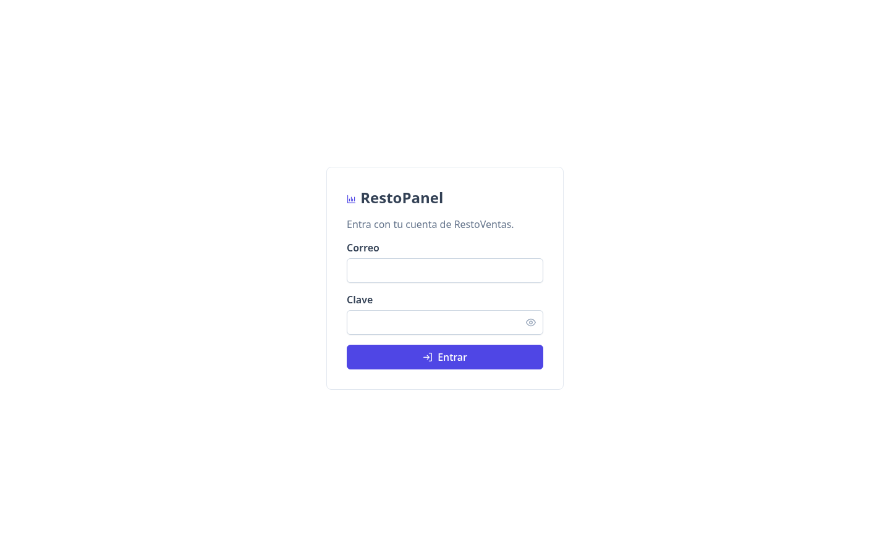
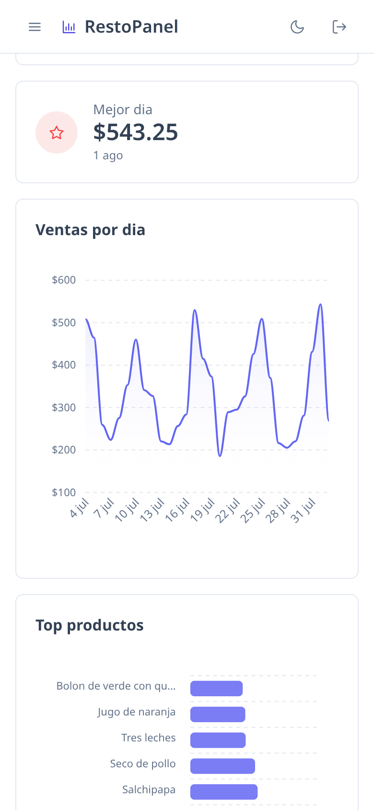

<div align="center">

<picture>
  <source media="(prefers-color-scheme: dark)" srcset="./docs/img/dashboard-oscuro.png"/>
  
</picture>

<br/>


### Panel analitico de las ventas que captura la app movil RestoVentas.

**Angular 21 standalone + signals, sin NgModules**
<br/>
**Cuatro tipos de grafico y un filtro de fechas que manda sobre todo el tablero**

<br/>

[](https://github.com/Mickaell22/restopanel)

<br/>

[](#stack)
[](#stack)
[](#stack)
[](#que-hace)

<br/>

[](#accesibilidad)
[](#accesibilidad)
[](#build-y-tests)
[](#build-y-tests)

[**Capturas**](#capturas) • [**Que hace**](#que-hace) • [**Stack**](#stack) • [**Como correr**](#como-correr) • [**Accesibilidad**](#accesibilidad)

</div>

---

## Que hace

Un restaurante carga sus ventas desde el celular con
[RestoVentas](https://github.com/Mickaell22/restoventas-app); RestoPanel es la
otra mitad: la pantalla grande donde se leen. Las dos consumen el mismo
[backend](https://github.com/Mickaell22/restoventas-backend), asi que son los
mismos datos.



- **Dashboard con KPIs y cuatro tipos de grafico**: linea temporal de ventas por
  dia, barras de top productos, dona por categoria (top 5 + "Otros") y radial
  por metodo de pago.
- **Filtro de fechas con una sola fuente de verdad**: atajos de 7/30/90 dias o
  rango a medida. Cambiarlo dispara **un** request (`/stats/dashboard` devuelve
  KPIs, serie y cortes juntos), asi que es imposible que dos graficos muestren
  rangos distintos.
- **Tabla de ventas** con orden, filtro global, paginacion y fila expandible que
  pide el detalle del ticket al desplegarse.
- **Gestion de productos** con reactive forms: alta, edicion, validaciones,
  confirmacion de borrado y el 409 del backend (producto con ventas) mostrado
  tal cual.
- **Tema claro/oscuro** con la preferencia guardada y, sin preferencia, la del
  sistema. La clase se aplica antes del bootstrap para que el modo oscuro no
  abra con un flash blanco.
- **Responsive** de 1440 a 390 px: la barra lateral fija pasa a drawer por
  debajo de 1024 px.

## Capturas

| Ventas | Productos |
| --- | --- |
|  |  |

| Dashboard en oscuro | Login | Movil |
| --- | --- | --- |
|  |  |  |

## Stack

| Pieza | Que se usa | Por que |
| --- | --- | --- |
| Framework | **Angular 21** standalone + signals | Sin NgModules; `rxResource` da `value/isLoading/error` sin escribir tres signals a mano. |
| UI | **PrimeNG 21** + `@primeuix/themes` 2 (Aura) | Tema con `darkModeSelector`, tablas y formularios accesibles de fabrica. Primario en indigo, no el emerald de Aura, por contraste. |
| Graficos | **ApexCharts 6** con una directiva propia | `ng-apexcharts` obliga a repartir la configuracion en ~15 `@Input` por grafico; la directiva recibe un unico `ApexOptions`, que es lo que devuelven los `computed`. |
| Datos | `HttpClient` + RxJS, consumidos con `rxResource` | Servicios que devuelven Observable, componentes que leen signals. |
| Tests | **Vitest** | 13 tests sobre la logica que no es pintar: opciones de los graficos, tema y filtro de `returnUrl`. |

Las versiones estan fijadas a proposito: PrimeNG 22 y `@primeuix/themes` 3 exigen
Angular 22, cuyo CLI pide Node >= 22.22.3. El detalle esta en
[`CLAUDE.md`](./CLAUDE.md).

## Como correr

El panel no funciona solo: consume `restoventas-backend` (NestJS) y exige login.

**1. Backend con datos de demo**

```bash
git clone https://github.com/Mickaell22/restoventas-backend
cd restoventas-backend
npm install           # y completar el .env (ver su README)
npm run migration:run # crea las tablas
npm run seed          # ~4.000 ventas en 120 dias, idempotente y reproducible
npm run start:dev     # http://localhost:3000
```

El seed crea el usuario de `SEED_EMAIL` / `SEED_PASSWORD` (los define el `.env`
del backend); son las credenciales con las que se entra al panel.

**2. Panel**

```bash
npm install
npm start             # http://localhost:4200
```

La URL del backend no esta hardcodeada: sale de `src/environments/`.
`environment.development.ts` apunta a `http://localhost:3000`; la de produccion
esta **vacia a proposito** y la define el despliegue, para que un build mal
configurado falle con un error explicito en el primer request en vez de apuntar
en silencio al host equivocado.

## Build y tests

```bash
npm run build         # dist/restopanel (estatico)
npm test              # 13 tests con Vitest
```

Todas las vistas se cargan con `loadComponent`, incluido el shell, asi que
ApexCharts (~900 kB sin comprimir) solo entra en el chunk del dashboard:

| Chunk | Transferido |
| --- | --- |
| Inicial (shell + estilos + Angular) | **116 kB** |
| `dashboard` (lazy, incluye ApexCharts) | 195 kB |
| `products` (lazy) | 20 kB |
| `sales` (lazy) | 3 kB |

## Accesibilidad

Objetivo declarado del proyecto: **0 violaciones de AXE** y WCAG AA. Lo que hubo
que corregir para llegar ahi esta anotado en [`CLAUDE.md`](./CLAUDE.md) — entre
otras cosas, el primario del tema (emerald 500 con texto blanco da 2.5:1) y el
rojo de los errores de formulario, que estuvo mal desde el dia 2 porque los
mensajes solo existen con el campo invalido **y** tocado, asi que ninguna pasada
de AXE los habia renderizado.

Ademas: navegacion con `aria-current` en el link activo, skip-link, foco visible,
tablas con `scope`, graficos con descripcion textual y `prefers-reduced-motion`
respetado en las animaciones de entrada.

## Estructura

```
src/app/
  core/         servicios (auth, products, sales, stats), modelos, tema, guard e interceptor
  layout/       shell: barra, navegacion y area de contenido
  features/
    auth/       login (reactive form)
    dashboard/  KPIs y los cuatro graficos
    sales/      tabla con detalle expandible
    products/   CRUD con reactive forms
  shared/       directiva de ApexCharts y filtro de rango de fechas
```

Las decisiones de diseno y los invariantes (por que el guard va en la ruta padre,
por que las fechas `YYYY-MM-DD` no se parsean con `new Date()`, por que los
colores viven en variables del tema) estan en [`CLAUDE.md`](./CLAUDE.md).
